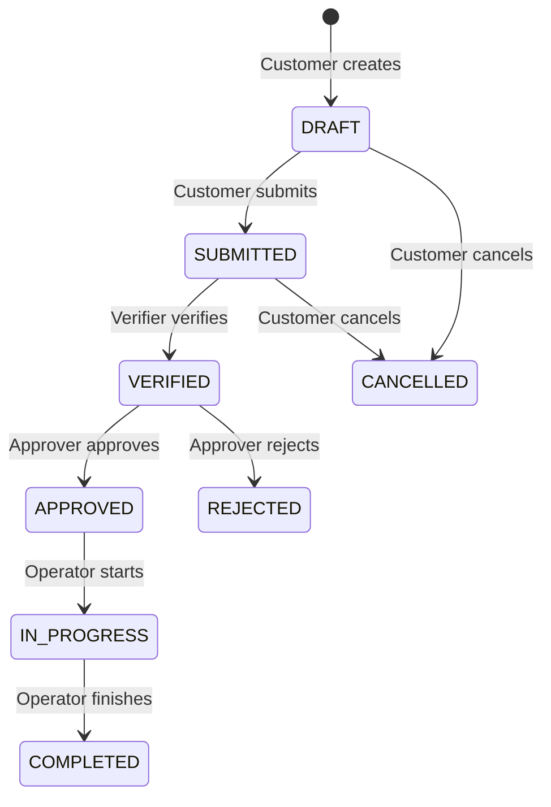

# Port Operations Management System

## Project Overview
The Port Operations Management System is a comprehensive solution for managing and orchestrating various port services, requests, workflows, and auditing within a centralized platform.

## Tech Stack
- **Java**: 21
- **Framework**: Spring Boot 4.0.7
- **Build Tool**: Gradle
- **Database**: PostgreSQL 16
- **Migration**: Flyway
- **Containerization**: Docker & Docker Compose
- **API Documentation**: SpringDoc OpenAPI (Swagger)

## Prerequisites
- Java 21 JDK
- Docker & Docker Compose
- IDE (IntelliJ IDEA / Eclipse / VS Code)

## Quick Start
To run the database and application using Docker:
```bash
docker-compose up --build
```
For local development where you only want the database in Docker:
```bash
docker-compose up postgres -d
```
Then run the app locally:
```bash
./gradlew bootRun
```

## Development Setup
- Database is configured to run at `localhost:5432` with username `portops` / password `portops_secret`.
- Make sure Flyway migrations are placed in `src/main/resources/db/migration`.
- Application starts on `http://localhost:8080`.

## API Documentation
Once the application is running, access the Swagger UI at:
- [http://localhost:8080/swagger-ui.html](http://localhost:8080/swagger-ui.html)

## Project Structure
- `src/main/java/com/portops/common`: Shared entities, enums, DTOs, configurations, and exception handlers.
- (Additional domain modules to be added)

## User Roles
- **CUSTOMER**: Can create and view their own requests.
- **OPERATOR**: Processes requests in the field.
- **VERIFIER**: Verifies the details of a submitted request.
- **APPROVER**: Approves or rejects a verified request.
- **FINANCE**: Handles billing and invoicing.
- **ADMIN**: Manages users and system settings.
- **VIEWER**: Read-only access across modules.

## Workflow Diagram

