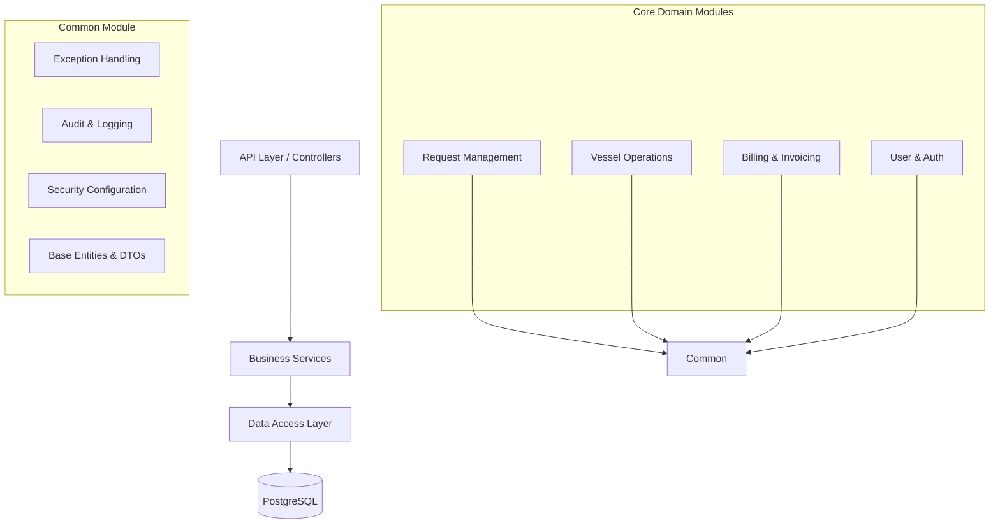

# System Architecture

## Modular Monolith Architecture
The Port Operations Management System adopts a Modular Monolith architecture. This allows for a clean separation of concerns and independent domain modules while maintaining the simplicity of a single deployable unit. 

## Module Boundaries

## Technology Decisions
- **Spring Boot 4.x**: Provides auto-configuration and rapid development capabilities.
- **Java 21**: Utilizes modern features like records and virtual threads (if enabled).
- **PostgreSQL**: Robust relational database for ACID transactions.
- **Flyway**: Reliable version control for database schemas.
- **JWT**: Stateless, scalable authentication.

## Security Model
- Stateless authentication using JWT tokens.
- Role-Based Access Control (RBAC) across endpoints via `@PreAuthorize`.
- Automatic auditing captures the `performedBy` user directly from the `SecurityContext`.

## Database Schema Overview
- Schemas will be heavily normalized to reduce redundancy.
- **Audit Logs** track state changes across all important domains, storing `previousValue` and `newValue` as JSON text to support historical reporting.
- Base tables will have standard auditing columns (`created_at`, `updated_at`, `created_by`, `updated_by`).
